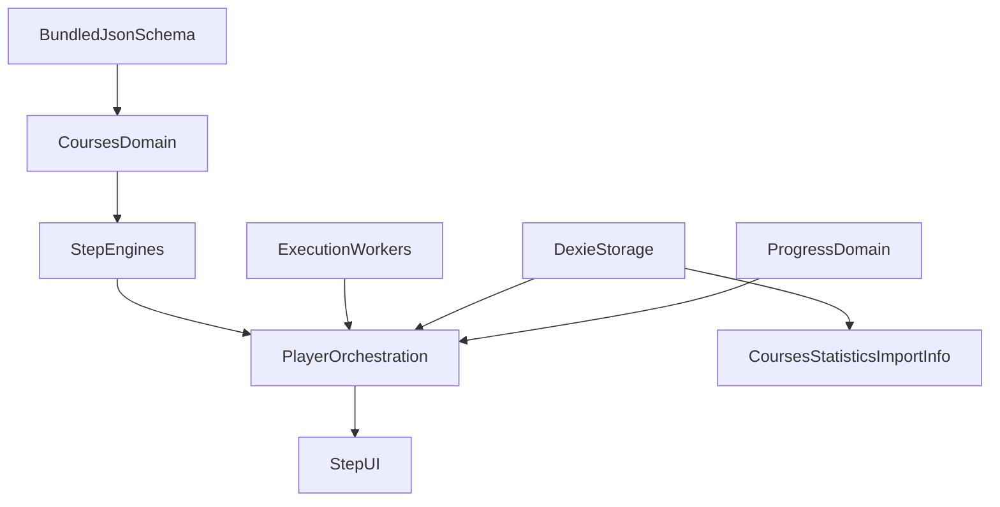

# vibetest — спецификация MVP

## Назначение

Offline-first PWA для прохождения курсов, импортированных из JSON.

Курс: модули → шаги. Типы шагов (`type`): **theory** (markdown), **svg** (inline SVG/анимация), **quiz**, **javascript** | **sqlite** | **regex** (практика с проверкой).

Backend и авторизация — вне MVP.

## Стек

- Angular 22, standalone, signals
- Dexie.js / IndexedDB
- `@angular/pwa` (Service Worker только в production build)
- Web Workers; sql.js для SQLite
- Zod — runtime-валидация импорта; типы из сгенерированных Zod-схем

## Структура приложения

Целевая раскладка `vibetest-app/` (имена файлов могут уточняться задачами; границы доменов — нет):

```text
vibetest-app/
├── tools/                          # генерация Zod из JSON Schema (npm script)
├── src/
│   ├── assets/schemas/             # bundled course.schema.json
│   └── app/
│       ├── app.ts, app.routes.ts   # shell, lazy routes
│       ├── courses/                # типы, parse, import, списки курса/модулей
│       │   └── generated/          # Zod/types — не редактировать вручную
│       ├── player/                 # orchestration, навигация, step UI по type
│       ├── execution/              # Worker protocol, wrapper, runners, *.worker.ts
│       ├── progress/               # агрегации, индикаторы — pure functions
│       ├── storage/                # Dexie, migrations, repositories
│       ├── statistics/             # страница статистики
│       ├── import/                 # страница импорта
│       ├── info/                   # страница схемы
│       └── shared/ui/              # переиспользуемые dumb-компоненты
```

- `*.spec.ts` — рядом с кодом; domain/storage logic без TestBed где возможно.
- Dexie — **только** `storage/`; domain не импортирует Dexie.
- `postMessage` / Worker — **только** через `execution/` (компоненты не вызывают Worker напрямую).
- Страницы — lazy (`loadComponent`); тяжёлые step UI — `@defer` или dynamic import.



## Формат курса

Структура полей и ограничения — [course.schema.json](./schemas/course.schema.json) (draft **2020-12**, **источник истины** в репозитории). В приложении хранится та же JSON Schema (bundle) и **сгенерированные** Zod-схемы и TypeScript-типы; generated-файлы не редактируют вручную. На сборке: JSON Schema → Zod + типы. Курс: корень → модули → шаги; `content` зависит от `type`.

**UUID v4** (`courseId`, `moduleId`, `stepId`): канонический RFC 4122, задаются автором, не меняются после публикации. В файле: один `courseId`; уникальные `moduleId` и пары `(moduleId, stepId)`. Невалидный UUID или дубликат → отклонение импорта.

Порядок модулей и шагов — порядок в массивах. `schemaVersion` ≠ 1 → отклонение импорта. Неизвестный `type` или невалидный JSON → отклонение.

## Типы шагов

Поля `content` — см. `$defs/*Content` в схеме.

### `theory`

`content` — строка markdown; рендер **без санитизации** (курс доверенный, ответственность автора). Прогресс `completed` по «Далее».

```json
{
  "stepId": "11111111-1111-4111-8111-111111111101",
  "type": "theory",
  "title": "Стрелочные функции",
  "content": "Стрелочная функция: `(x) => x * 2`."
}
```

### `svg`

Inline SVG (SMIL/CSS и т.п.); рендер **без санитизации** (курс доверенный). Без автопроверки — как theory.

```json
{
  "stepId": "11111111-1111-4111-8111-111111111102",
  "type": "svg",
  "title": "Схема",
  "content": {
    "svg": "<svg xmlns=\"http://www.w3.org/2000/svg\" viewBox=\"0 0 64 64\"><circle cx=\"32\" cy=\"32\" r=\"24\" fill=\"#4a90d9\"/></svg>",
    "caption": "Опционально"
  }
}
```

### `quiz`

Один индекс в `correctIndices` → radio; несколько → checkbox. В схеме: уникальные индексы; при импорте дополнительно проверять, что каждый индекс `< options.length`. Локальная проверка; успех → `completed`.

```json
{
  "stepId": "11111111-1111-4111-8111-111111111104",
  "type": "quiz",
  "title": "Проверка",
  "content": {
    "question": "Как объявить стрелочную функцию?",
    "options": ["x => x * 2", "function(x) { return x }"],
    "correctIndices": [0]
  }
}
```

### Практика (`javascript`, `sqlite`, `regex`)

Проверка в Web Worker. Обязательное **`timeoutMs`** (100–30000): лимит на прогон шага; по истечении — завершение Worker и ошибка шага. Курсы **доверенные**; Worker защищает от зависания, не от произвольного кода в origin.

Кейсы `tests` выполняются **по порядку**; при первом провале, runtime-ошибке или timeout дальнейшие кейсы **не** запускаются.

`reset` (только `javascript` / `sqlite`) — очистка среды перед **каждым** элементом `tests` (включая первый). У `regex` полей `setup` / `reset` нет.

**Подготовка (один раз на прогон):**

- **JavaScript:** две изолированные среды — код пользователя и эталон: `setup` (только подготовка к выполнению решения, **без** проверочных данных), затем загрузка `starterCode` / `referenceSolution`. Каждый **`argsGenerator`** — самодостаточная строка с **полным** выражением функции без параметров (например `"() => [2, 3]"`); движок **не** дописывает обёртку. Вызов — в **отдельной изолированной** среде на каждый кейс (без `setup`/`reset` шага, без starter/reference).
- **SQLite:** две среды, `setup` + load starter/reference.
- **Regex:** только паттерны и `tests`.

**На каждый элемент `tests`:**

1. **JavaScript:** evaluate `argsGenerator` → массив аргументов (≤ 20 элементов, только JSON-совместимые значения); иначе ошибка кейса и стоп. Затем `reset` в средах пользователя и эталона (если задан и не пустой), вызов `functionName(...args)` с **одним и тем же** сгенерированным массивом.
2. **SQLite:** `reset` (обе среды), `tests[i].seed`, выполнение и сравнение.
3. **Regex:** выполнение и сравнение.
4. При fail / runtime error / timeout — стоп (fail-fast).

| Тип | Сравнение | Прочее |
|-----|-----------|--------|
| `javascript` | возврат `functionName(...args)` — JSON-совместимые значения; структурное сравнение | `setup`/`reset`; `{ "argsGenerator": "…" }`; `functionName`; `timeoutMs` |
| `sqlite` | строки результата; порядок при `orderMatters: true`, иначе multiset | DDL `setup`; `reset`; `{ "seed": … }`; `orderMatters`; `timeoutMs` |
| `regex` | `RegExp.test(input)` | `{ "input": string }`; `timeoutMs` |

```json
{
  "stepId": "11111111-1111-4111-8111-111111111105",
  "type": "javascript",
  "title": "Сумма",
  "content": {
    "description": "Реализуйте `add(a, b)`.",
    "starterCode": "const add = (a, b) => 0;",
    "referenceSolution": "const add = (a, b) => a + b;",
    "setup": "",
    "reset": "",
    "functionName": "add",
    "timeoutMs": 2000,
    "tests": [
      { "argsGenerator": "() => [2, 3]" },
      { "argsGenerator": "() => [0, 5]" },
      { "argsGenerator": "() => [4, 1]" }
    ]
  }
}
```

```json
{
  "stepId": "11111111-1111-4111-8111-111111111106",
  "type": "sqlite",
  "title": "Пользователь",
  "content": {
    "description": "Найдите пользователя с id = 1.",
    "setup": "CREATE TABLE users(id INT, name TEXT);",
    "reset": "DELETE FROM users;",
    "starterCode": "SELECT * FROM users WHERE id = 1;",
    "referenceSolution": "SELECT id, name FROM users WHERE id = 1;",
    "orderMatters": false,
    "timeoutMs": 5000,
    "tests": [
      { "seed": "INSERT INTO users VALUES(1, 'Anna');" },
      { "seed": "INSERT INTO users VALUES(1, 'Bob');" }
    ]
  }
}
```

```json
{
  "stepId": "11111111-1111-4111-8111-111111111107",
  "type": "regex",
  "title": "Цифры",
  "content": {
    "description": "Строка из цифр.",
    "starterCode": "^\\d+$",
    "referenceSolution": "^\\d+$",
    "timeoutMs": 1000,
    "tests": [{ "input": "123" }, { "input": "abc" }]
  }
}
```

## Импорт

Вкладка **Импорт**: многострочное поле JSON, кнопки **Взять из буфера** (вставить текст из clipboard в поле) и **Импортировать**.

- **Импортировать**: разбор JSON → валидация **Zod** → semantic rules (UUID, уникальность id; quiz indices; практика — `tests`, `timeoutMs`, у JS — `argsGenerator`, `reset` без seed-данных; у JS `setup` не для таблиц кейсов — проверочные аргументы только в `argsGenerator`; `schemaVersion` только `1`).
- Успех — сохранение в IndexedDB. При ошибках — **список всех** найденных проблем (JSON parse, Zod, semantic) **под полем импорта**; курс не сохраняется.
- Существующий `courseId` — «заменить» или «отменить»; замена удаляет прогресс курса.

## Хранилище (IndexedDB)

| Таблица        | Содержимое |
|----------------|------------|
| `courses`      | JSON курса целиком, key `courseId` |
| `stepProgress` | key `${courseId}::${moduleId}::${stepId}`; `status`: `not-started` \| `in-progress` \| `completed`; черновики по типу шага; признак неудачной последней проверки (quiz/практика) для UI |

Статус модуля и курса — агрегация по шагам. Удаление курса — одной транзакцией (курс + прогресс).

## Экраны

Вверху — горизонтальная навигация: **Курсы** | **Статистика** | **Импорт** | **Инфо**. По умолчанию открыта вкладка **Курсы**.

### Курсы

Список карточек: **название**, **прогресс** (число модулей и сколько модулей полностью пройдено), кнопка **Пройти** → экран **модулей** этого курса. На карточках модулей — то же (название, прогресс по шагам модуля, **Пройти**).

**Пройти** у модуля → **плеер** на **первом непройденном** шаге; если все шаги `completed` — с **первого** шага модуля.

### Плеер

Над контентом — ряд **квадратиков** (по одному на шаг); tap/клик переходит на шаг. Состояния: **текущий** (серый), **ошибка последней проверки** (красный, quiz/практика), **пройден** (`completed`, зелёный), **не тронут** (нейтральный). Приоритет: **текущий → ошибка → пройден → не тронут**. **Повторить** — сброс черновика и флага ошибки; статус **`completed` не снимается**, если шаг уже был успешно пройден.

Навигация в модуле — только кнопки **Назад** / **Далее** (MVP ориентирован на **touch**, без горячих клавиш стрелок). На последнем шаге вместо «Далее» — **Выход** → модули; на экране модулей — **Выход** → курсы.

### Статистика

Сводка по импортированным курсам: прогресс, пройденные модули/шаги (агрегация из `stepProgress`).

### Импорт

См. раздел **Импорт** выше.

### Инфо

Просмотр формата курса: **bundled** [course.schema.json](./schemas/course.schema.json) — форматированный JSON (read-only). На MVP без отдельного UI-рендера полей.

## Offline / PWA

Контент курсов в IndexedDB после импорта; app shell и статика — SW. sql.js/WASM кэшируется при первом использовании.

## Вне MVP

- Backend, синхронизация, аккаунты
- Визуальный редактор курсов
- Рейтинги, соц. функции
- Песочница для недоверенного JavaScript
- Санитизация markdown/SVG и ограничения SVG-ресурсов (контент доверенный)
