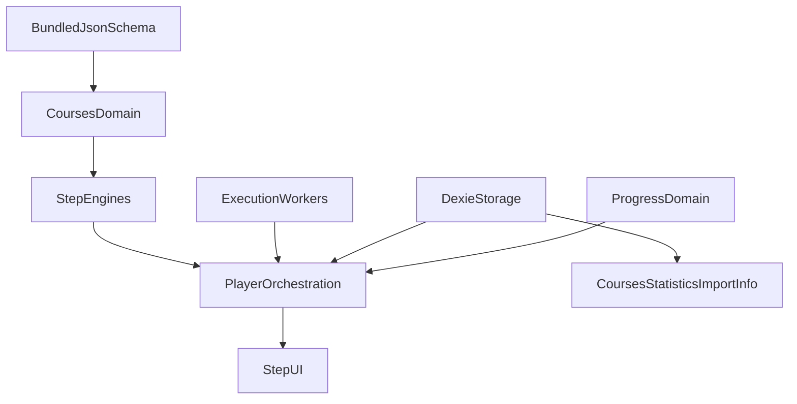

# vibetest — спецификация MVP

## Назначение

Offline-first PWA для прохождения курсов из встроенного комплекта и импортированных из JSON.

Курс: модули → шаги. Типы шагов (`type`): **theory** (markdown), **svg** (inline SVG/анимация), **quiz**, **javascript** | **sqlite** | **regex** (практика с проверкой).

Backend и авторизация — вне MVP.

## Стек

- Angular 22, standalone, signals
- Dexie.js / IndexedDB
- `@angular/pwa` (Service Worker только в production build)
- Web Workers; sql.js для SQLite
- Zod — runtime-валидация формата курса; типы из сгенерированной Zod-схемы

## Структура приложения

Целевая раскладка `vibetest-app/` (имена файлов могут уточняться задачами; границы доменов — нет):

```text
vibetest-app/
├── tools/                          # генерация Zod из JSON Schema (npm script)
├── public/
│   └── schemas/                    # bundled course.schema.json
├── src/
│   └── app/
│       ├── app.ts, app.routes.ts   # shell, lazy routes
│       ├── courses/                # типы, parse, import, списки курса/модулей
│       │   └── generated/          # Zod/types — не редактировать вручную
│       ├── player/                 # orchestration, навигация, step UI по type
│       ├── execution/              # Worker protocol, wrapper, runners, *.worker.ts
│       ├── progress/               # агрегации, индикаторы — pure functions
│       ├── storage/                # Dexie, migrations, repositories
│       ├── statistics/             # страница статистики
│       ├── import/                 # страница импорта
│       ├── info/                   # страница схемы
│       ├── prompt-generation/      # промты для LLM (одним промтом и по этапам)
│       ├── course-generation/    # вызов LM Studio и импорт курса
│       └── shared/                 # ui, build-info (generated), clipboard
```

- `*.spec.ts` — рядом с кодом; domain/storage logic без TestBed где возможно.
- Dexie — **только** `storage/`; domain не импортирует Dexie.
- `postMessage` / Worker — **только** через `execution/` (компоненты не вызывают Worker напрямую).
- Страницы — lazy (`loadComponent`); тяжёлые step UI — `@defer` или dynamic import.


```mermaid
flowchart TD
  Schema[BundledJsonSchema] --> Courses[CoursesDomain]
  Courses --> Engines[StepEngines]
  Engines --> Player[PlayerOrchestration]
  Execution[ExecutionWorkers] --> Player
  Storage[DexieStorage] --> Player
  Progress[ProgressDomain] --> Player
  Player --> StepUI[StepUI]
  Storage --> Pages[CoursesStatisticsImportInfo]
```

## Формат курса

Три JSON Schema (draft **2020-12**), без перекрёстных `$ref`:

| Схема | Назначение |
|-------|------------|
| [course-import.schema.json](./schemas/course-import.schema.json) | JSON автора для **импорта курса**: `schemaVersion`, `title`, `description`, `modules` / `steps` **без** UUID и без `createdAt` |
| [module-import.schema.json](./schemas/module-import.schema.json) | JSON автора для **добавления одного модуля** в конец существующего курса: `schemaVersion`, `title`, `steps` **без** `moduleId` / `stepId` |
| [course.schema.json](./schemas/course.schema.json) | **Канонический DTO** в IndexedDB и domain `Course`: обязательны `schemaVersion: 1`, `courseId`, `createdAt` (ISO 8601 date-time), у каждого модуля `moduleId`, у каждого шага `stepId` |

В bundle приложения (`public/schemas/`) — все три схемы (`course`, `course-import`, `module-import`) + **сгенерированные** Zod и TypeScript; generated-файлы не редактируют вручную.

Отдельно для **поэтапной генерации курса** — [course-outline.schema.json](./schemas/course-outline.schema.json): план курса (`schemaVersion`, `title`, `description`, `modules[]` с `title`, `summary`, `steps[]` из `type`, `title`, `summary`) без содержимого шагов. Тоже копируется в `public/schemas/`, Zod генерируется (`course-generation/generated/`).

У свойств и `$defs` во всех трёх схемах заданы русские **`description`** (семантика для авторов и LLM при генерации курса/модуля); ограничения валидации (`type`, `required`, лимиты длины) не дублируют SPEC, а дополняют его. Для **`javascriptContent`** голая JSON Schema **не** выражает XOR `functionName`|`construct` и reserved words для имён — полная семантика импорта/parse в приложении через **`JavascriptContentWithTargetSchema`** (см. `$comment` в схеме).

**UUID v4**: RFC 4122, назначаются приложением при импорте (`crypto.randomUUID()`). Дубликаты `courseId` / `moduleId` / `stepId` в одном сохранённом документе → отклонение на этапе semantic validation.

Порядок модулей и шагов — порядок в массивах. `schemaVersion` ≠ 1 → отклонение. Неизвестный `type` или невалидный JSON → отклонение.

## Типы шагов

Поля `content` — см. `$defs/*Content` в схеме и **`description`** у каждого поля.

**Markdown в плеере:** theory `content`; practice `description`; quiz `question` (блочный) и `options[]` (inline); svg `description` (блочный) и `caption` (inline). Рендер **без санитизации** (курс доверенный). Строки интерпретируются как Markdown: сырой HTML без backticks становится разметкой; `*`/`_` — emphasis; escape в regex/SQL без inline code или fenced-блоков может измениться. Авто-миграции старых курсов в IndexedDB нет — при необходимости переимпорт с корректной разметкой.

### `theory`

`content` — строка markdown; рендер **без санитизации** (курс доверенный, ответственность автора). Прогресс `completed` по «Далее».

```json
{
  "type": "theory",
  "title": "Стрелочные функции",
  "content": "Стрелочная функция: `(x) => x * 2`."
}
```

### `svg`

Inline SVG (SMIL/CSS и т.п.); рендер SVG **без санитизации** (курс доверенный). Без автопроверки — как theory. Поля **`caption`** и **`description`** — Markdown (caption: inline; description: блочный, как theory); рендер **без санитизации**.

В карточке шага SVG **вписывается** в область figure (без внутреннего scroll). Кнопка **«Развернуть»** открывает in-app overlay (`role="dialog"`) на весь viewport: SVG целиком (в DOM только одна копия разметки), **+** / **−** / **Сброс** (масштаб 1–4 от fit-baseline), **pan** одним pointer при scale > 1, **pinch** двумя пальцами и **zoom** колёсиком мыши (масштаб вокруг точки жеста); закрытие — «Закрыть», backdrop, Escape; сброс zoom/pan и возврат фокуса на «Развернуть». Browser Fullscreen API — не используется.

```json
{
  "type": "svg",
  "title": "Схема",
  "content": {
    "svg": "<svg xmlns=\"http://www.w3.org/2000/svg\" viewBox=\"0 0 64 64\"><circle cx=\"32\" cy=\"32\" r=\"24\" fill=\"#4a90d9\"/></svg>",
    "caption": "Опционально"
  }
}
```

### `quiz`

Один индекс в `correctIndices` → radio; несколько → checkbox. В схеме: уникальные индексы; при импорте дополнительно проверять, что каждый индекс `< options.length`. Локальная проверка; успех → `completed`. **`question`** — блочный Markdown (как theory); **`options[]`** — inline Markdown; рендер **без санитизации**.

```json
{
  "type": "quiz",
  "title": "Проверка",
  "content": {
    "question": "Как объявить стрелочную функцию?",
    "options": ["x => x * 2", "function(x) { return x }"],
    "correctIndices": [0]
  }
}
```

### Практика (`javascript`, `sqlite`, `regex`)

Поле **`description`** — блочный Markdown (как theory); рендер **без санитизации**.

**JavaScript — особые значения в `tests[].args` и `calls[].args`:** JSON не поддерживает `undefined`, `NaN`, `Infinity`, `-0`, `BigInt`. Используй объектные теги (ключ **`$js`** зарезервирован): `{"$js":"undefined"}`, `{"$js":"NaN"}`, `{"$js":"Infinity"}`, `{"$js":"-Infinity"}`, `{"$js":"-0"}`, `{"$js":"bigint","value":"123"}`. При импорте теги валидируются; перед вызовом декодируются; при сравнении (equal-path) кодируются обратно. Сравнение return, args и reject reason идёт по закодированной форме: `undefined` / bigint / `NaN` / ±`Infinity` / `-0` на любой глубине превращаются в теги, в том числе верхнеуровневый bigint. **Верхнеуровневый** `undefined` в return/reject reason по-прежнему fail (`non-JSON result`) — защита void-функций; для них — **`resultMode: "args"`**. Ключ **`$js`** зарезервирован и в сравниваемых значениях: plain-объект `{"$js": "NaN"}` в return равен настоящему `NaN` на другой стороне. Ключ со значением `undefined` ≠ отсутствующему ключу (`{a: undefined}` ≠ `{}`). Checker получает декодированные materialized args и сырой return.

Проверка в Web Worker. Обязательное **`timeoutMs`** (100–30000): один deadline на **весь** шаг практики (javascriptInit/sqliteInit/regexInit + все `tests[]`, не per-case); кооперативно в раннере через `Date.now()` / `deadlineMs`, плюс watchdog на **main thread** (`ExecutionWorkerWrapperService` / practice runner → `Worker.terminate()` при превышении). Воркер сам sync hang не прерывает. **SQLite:** загрузка движка (sql.js + WASM, сообщение `sqliteLoad`) — отдельный лимит 30 с, в `timeoutMs` не входит; deadline шага начинается после неё. SQL-воркер переиспользуется между запусками в плеере (движок компилируется один раз; при открытии sqlite-шага загрузка стартует заранее) и при проверке шагов импорта; после таймаута воркер пересоздаётся. У SQL-воркера один владелец за раз: если «Запустить» нажали, пока идёт фоновая загрузка, прогон ждёт её окончания (после успешной загрузки движок уже готов); если фоновая загрузка упала по таймауту, её воркер уничтожается, а прогон получает новый воркер и свои 30 с на загрузку — чужой таймаут прогон не обрывает. Фоновая загрузка не запускается повторно, пока предыдущая не завершилась. Ошибки воркера (загрузка движка, ошибка в `setup`, невалидный запрос) возвращаются с `id` запроса — текстом, а не таймаутом. Сбой до первой проверки (загрузка движка, `setup`) и исключение раннера (таймаут, сбой воркера) ученик видит как «Ошибка выполнения: …» без номера проверки; «Проверка N не пройдена» — только когда кейс N действительно выполнялся. Ошибка сохранения прогресса после прогона не выдаётся за ошибку выполнения: результат прогона остаётся на экране. У JavaScript thenable **checker** — отдельный cap 250 ms по **wall-clock** `Date.now()+250` (не fake timers practice bag, не `deadlineMs` кейса); bag `ctx` заморожен (`Object.freeze`); sync hang в checker/коде ученика — общий `timeoutMs` / terminate без деталей кейса. **`structure.args`** materialize всегда; **`structure.result`** serialize — только equal-path без checker. Курсы **доверенные**; Worker защищает от зависания, не от произвольного кода в origin.

В плеере черновик practice редактируется в **CodeMirror 6** (подсветка: JavaScript / SQL / plain text для regex); редактор грузится lazy-chunk, оформление — через CSS variables темы приложения.

Кейсы `tests` выполняются **по порядку**; при первом провале, runtime-ошибке или timeout дальнейшие кейсы **не** запускаются.

**Статистика прогона (javascript / sqlite / regex):** после «Запустить» в UI показывается «Тесты: N из M» — при fail-fast N = число пройденных кейсов до провала (или 0 при ошибке init), M = `tests.length`. При **успехе** дополнительно — суммарное время кода пользователя и эталона по всем кейсам и сравнение («медленнее / быстрее / сопоставимо»). Время измеряется в Worker через `performance.now()` только для кода под проверкой (JS — цепочка вызовов **последовательно**: сначала user, затем reference; SQL — `query` user и reference по очереди; regex — `RegExp.test` по очереди); `reset`, seed, checker и сравнение результатов не входят. Коэффициент «в N раз» показывается только если **обе** суммы, их разница и **меньшая** из сумм ≥ ~1 ms; иначе «сопоставимо» или «быстрее / медленнее» без коэффициента. Статистика транзиентна (не в progress). Без cross-origin isolation разрешение таймера в Worker может быть грубым.

`reset` (только `javascript` / `sqlite`) — авторский код очистки перед **каждым** элементом `tests` (включая первый), если поле задано и не пустое; **отсутствие или пустая строка** — no-op для авторского кода. У `regex` полей `setup` / `reset` нет. У **JavaScript** фаза перед каждым кейсом (включая пустой `reset`) всегда: авторский `reset` (если не пустой) → `timers.reset()` → recompile (`clearSpyRegistry` + `setup` + код). **`reset`** видит только fake timers, **не** `registerSpy`. Practice **bag** переиспользуется между кейсами: `globalThis.foo` в коде ученика может пережить applyReset. Spy регистрировать в **`setup`**; не сохранять ссылки на wrapped spy вне реестра (иначе счётчик не сбрасывается при `clearSpyRegistry` — UB).

**Подготовка (один раз на прогон):**

- **JavaScript:** две изолированные среды — код пользователя и эталон: `setup` (подготовка к выполнению решения; **не** класть проверочные данные в `setup` — авторская конвенция, не проверяется при импорте), затем загрузка `starterCode` / `referenceSolution`.
- **SQLite:** две среды, `setup` + load starter/reference.
- **Regex:** только паттерны и `tests`.

**На каждый элемент `tests`:**

1. **JavaScript:** фаза reset (авторский `reset`, если не пустой; затем всегда timers/spy/recompile — см. выше). Опционально **`structure`**: для каждого позиционного аргумента `tests[i].args` и каждого `calls[].args` — materialize по `structure.args[j]` (`list` | `tree` | `raw`; отсутствующий индекс = `raw`): `list` — `number[]` → цепочка `{ val, next }` (пустой `[]` → `null`); `tree` — level-order `(number|null)[]` → `{ val, left, right }` (`[]` / ведущий `null` → `null`); `raw` — `structuredClone`. Args клонируются **отдельно** для user и reference **до** materialize. Первичный шаг: либо вызов **`functionName(...args)`**, либо при **`construct: { className }`** — `new className(...args)` (класс должен быть функцией/конструктором после load; иначе fail). Ровно одно из `functionName` | `construct`. Опционально **`calls`** (≤ 20 шагов): на результате первого вызова в user и reference **одинаково** для каждого элемента — если задан **`method`**, то `current = current[method](...call.args)`, иначе `current = current(...call.args)` (результат предыдущего шага должен быть callable); `call.args` materialize тем же `structure.args` по позиции. Пустой `calls: []` — только первичный вызов. После **каждого** шага (`args` и каждый элемент `calls`): если результат **thenable** (`typeof then === 'function'`), **await** перед следующим шагом; если **не thenable** — без await на этом шаге. Microtasks из sync-тела шага остаются до `flushMicrotasks` / `advanceMs` **только** если обе среды и все шаги кейса завершились без await thenable (полностью sync-путь); любой await thenable на любой стороне дренирует общую host-очередь microtasks до фазы таймеров. Pending без settle до исчерпания **`timeoutMs`** прогона шага → fail. Опционально **`rejects: true`**: обе среды должны **reject** (thenable); reason: `Error` → сравнение **`message`**; иначе reason через тот же recursive JSON-compatible equal; sync throw ≠ reject (fail кейса); при `rejects: true` поля **`resultMode`** / serialize result / **`unordered`** / **`checker`** **не** применяются (только reasons). Без `rejects` обе должны fulfill. После fulfill (и после flushMicrotasks / advanceMs / expectInvocations — см. ниже): если задан step-level **`checker`** (строка, исходник функции `(ctx) => boolean`, max 10000) — **полностью заменяет** default equal / `resultMode` / `unordered`; выполняется в **отдельном** sandbox (не user/reference `globalThis`); bag **`ctx`** заморожен (`Object.freeze`); thenable-return — cap **250 ms** отдельно от `deadlineMs` кейса; sync hang — общий `timeoutMs` / terminate. `ctx`: `userResult`, `refResult` (**сырой** return), `userArgs`, `refArgs` (**materialized**, не serialized; `structure.result` — только через хелперы в checker); `tests[].unordered` не применяется — **`ctx.sortUnordered`**. Хелперы `deepEqual`, `serializeList`, `serializeTree`, `sortUnordered`. Присвоение свойствам `ctx` → throw; deep-mutation значений и утечки ссылок — undefined behaviour. Return строго `boolean` (`true` → pass, `false` → fail); non-boolean / throw / timeout → fail с message (без исходника checker в feedback ученику). Детерминизм; запрет `Math.random` / `Date.now` / I/O — конвенция автора; поле **не** показывается ученику (как `referenceSolution`). Предпочтительный путь авторов — флаги vt-47…49; `checker` — узкий escape hatch. Без `checker` → сравнение по **`resultMode`** (default / отсутствие = `"return"`): `"return"` — финальный return после serialize `structure.result` (`list`/`tree`/`raw`); `"args"` — только массив **`tests[i].args`** после прогона (materialize + serialize по `structure.args`; **не** `calls[].args`; return **может** быть `undefined` / non-JSON); `"both"` — и return, и `tests[i].args`. Serialize list/tree: обход с cycle-detect и cap **10000** узлов → fail с message при cycle/overflow; list → `number[]`, tree → level-order с trim trailing `null`. Опционально **`unordered: true`** на кейсе: **после** serialize, **перед** equal — рекурсивная нормализация: массивы — normalize элементов, затем sort по стабильному `JSON.stringify` ключу; plain objects — normalize values (ключи при сборке по `Object.keys().sort()`); примитивы без изменений. Не использовать, если порядок внутри части ответа важен (тогда `checker`). Fulfill vs reject → fail. **Await thenable не двигает fake clock** (только host microtasks/deadline). Затем (если заданы): **`flushMicrotasks: true`** — один host microtask checkpoint (`Promise.resolve()` tick), общий для user/reference; **`advanceMs`** (0…60000) — синхронное lockstep-продвижение **раздельных** fake clock user/reference на одну величину и выполнение due macrotasks (`setTimeout` / `setInterval` / `clear*` на изолированном `globalThis` среды; лимит pending timers и callbacks за advance → fail). Опционально **`expectInvocations`**: для каждого ключа — число вызовов spy из **`setup`** через конвенцию `registerSpy` / `__vibetestSpies` / `__vibetestGetCount`; user === reference === ожидание, иначе fail. **`Date` не подменяется.**
2. **SQLite:** `reset` в обеих средах (no-op, если не задан или пустой), `tests[i].seed`, выполнение и сравнение.
3. **Regex:** `RegExp.test(input)` у паттерна пользователя и эталона на одном `input`; успех, если оба boolean **совпадают**.
4. При fail / runtime error / timeout — стоп (fail-fast).

| Тип | Сравнение | Прочее |
|-----|-----------|--------|
| `javascript` | после await + spies: при `checker` — sandbox `(ctx)=>boolean` (freeze ctx; сырые results; args materialized; хелперы + `sortUnordered`; thenable cap 250 ms) вместо equal; иначе по `resultMode` (default `return`) — return и/или args после `structure` serialize (без `structure.args` — raw); опционально `unordered` перед equal; при `rejects` — только reason. Для equal: **JSON-совместимо** (кроме `resultMode: "args"|"both"`). Особые значения (`undefined`, `bigint`, `NaN`, ±`Infinity`, `-0`) перед equal кодируются в теги `{"$js": ...}` и сравниваются как JSON. **Не-JSON** (fail): верхнеуровневый `undefined` в return/reject reason, `function`, `symbol`, не-plain объекты. Recursive equal. | `setup`/`reset`; `{ "args", "calls"?, "rejects"?, "expectInvocations"?, "advanceMs"?, "flushMicrotasks"?, "unordered"? }`; ровно одно из `functionName` \| `construct`; опционально `resultMode`, `structure`, `checker`; `timeoutMs`; в `setup` — `registerSpy(name, fn)` (раннер также инжектирует helper) |
| `sqlite` | строки результата; порядок при `orderMatters: true`, иначе multiset | DDL `setup`; `reset`; `{ "seed": … }`; `orderMatters`; `timeoutMs` |
| `regex` | `RegExp.test(input)` user vs reference — одинаковый boolean | `{ "input": string }`; `timeoutMs` |

```json
{
  "type": "javascript",
  "title": "Сумма",
  "content": {
    "description": "Реализуйте `add(a, b)`.",
    "starterCode": "const add = (a, b) => 0;",
    "referenceSolution": "const add = (a, b) => a + b;",
    "setup": "",
    "reset": "",
    "functionName": "add",
    "timeoutMs": 2000,
    "tests": [
      { "args": [2, 3] },
      { "args": [0, 5] },
      { "args": [4, 1] }
    ]
  }
}
```

```json
{
  "type": "sqlite",
  "title": "Пользователь",
  "content": {
    "description": "Найдите пользователя с id = 1.",
    "setup": "CREATE TABLE users(id INT, name TEXT);",
    "reset": "DELETE FROM users;",
    "starterCode": "SELECT * FROM users WHERE id = 1;",
    "referenceSolution": "SELECT id, name FROM users WHERE id = 1;",
    "orderMatters": false,
    "timeoutMs": 5000,
    "tests": [
      { "seed": "INSERT INTO users VALUES(1, 'Anna');" },
      { "seed": "INSERT INTO users VALUES(1, 'Bob');" }
    ]
  }
}
```

```json
{
  "type": "regex",
  "title": "Цифры",
  "content": {
    "description": "Строка из цифр.",
    "starterCode": "^\\d+$",
    "referenceSolution": "^\\d+$",
    "timeoutMs": 1000,
    "tests": [{ "input": "123" }, { "input": "abc" }]
  }
}
```

## Импорт

### Встроенные курсы (bundled)

При `npm run build` / `ng serve` (prebuild / prestart) из `docs/courses/*.json` генерируются canonical-курсы с **детерминированными** `courseId` / `moduleId` / `stepId` (SHA-256 от содержимого import-DTO + счётчик для вложенных UUID). Файлы — `public/bundled-courses/*.json`; манифест — `generated-bundled-courses.ts`. Service Worker кеширует `/bundled-courses/**`.

При старте приложения (`APP_INITIALIZER`; `BundledCoursesService` подгружается через `import()` и не входит в начальный бандл): для каждой записи манифеста, чей `courseId` ещё **не** в `settings.bundledCoursesSeen`, выполняется fetch → parse → `courses.put` (если курса нет), затем ID добавляется в `bundledCoursesSeen`. Курсы загружаются **параллельно**, таймаут **15 s** на запрос (`AbortSignal.timeout`) — суммарно старт ждёт не дольше ~15 s. Ошибки fetch/parse не блокируют bootstrap; неустановленный курс не помечается «увиденным» и будет повторён при следующем старте. Удалённый пользователем встроенный курс **не** восстанавливается при следующем старте (ID уже «видели»). Изменение **семантики** import-DTO в новой версии приложения даёт **новый** `courseId` → устанавливается как отдельный курс; старый и прогресс сохраняются (переформатирование JSON без изменения DTO ID не меняет).

**Настройки** — кнопка «Добавить недостающие курсы»: для всех записей манифеста, отсутствующих в Dexie, повторная установка (без диалога, параллельно). Статус: «Добавлено: N»; при сбоях загрузки — «Не удалось загрузить: M» (при частичном успехе — «Добавлено: N. Не удалось загрузить: M»); если ничего не отсутствует — «Все встроенные курсы уже установлены»; если не удалось прочитать список курсов — «Не удалось проверить встроенные курсы».

Вкладка **Импорт** — две секции: **импорт курса** и **импорт модуля**.

**Импорт курса:** многострочное поле JSON, флажок **Заменить все ID новыми UUID** (включён по умолчанию при каждом открытии формы), флажок **Проверка js/sql/regex шагов** (выключен по умолчанию), кнопки **Взять из буфера** (вставить текст из clipboard в поле) и **Импортировать**.

**Импорт модуля:** выпадающий список существующих курсов (по `title`, порядок как в списке курсов), поле JSON по [module-import.schema.json](./schemas/module-import.schema.json), флажок **Проверка js/sql/regex шагов** (выключен по умолчанию), **Взять из буфера**, **Добавить модуль**. Успех — модуль дописывается **в конец** `modules[]` выбранного курса; **прогресс** существующих шагов **не** сбрасывается. Лимит **100** модулей на курс. Курс в IndexedDB по-прежнему один JSON-документ на `courseId`.

Поток **Импортировать** (курс):

1. Разбор JSON: чистый текст import-DTO или **один** fenced-блок ` ```json … ``` ` (без текста до/после блока).
2. Валидация Zod по [course-import.schema.json](./schemas/course-import.schema.json) (JSON **без** UUID и `createdAt`).
3. Преобразование import-DTO → canonical `Course`: новые `courseId`, `moduleId`, `stepId` и `createdAt` (момент импорта).
4. Semantic rules на canonical `Course`: уникальность всех ID; quiz indices; практика — `tests`, `timeoutMs`; у **SQLite** — поле `reset` не должно содержать seed-DML (проверка SQL-токенами с границей слова, напр. `\bINSERT\b`, `\bINTO\b`; seed только в `tests[].seed`); **JavaScript `reset`** этой SQL-эвристикой **не** проверяется.
5. Если включена **Проверка js/sql/regex шагов**: для каждого шага `javascript` / `sqlite` / `regex` — dual-run `referenceSolution` против себя (существующие practice runners в Worker); собираются **все** ошибки шагов; при любой ошибке этап **practice**, курс не сохраняется.
6. Если включён **Заменить все ID новыми UUID**: повторный перевыпуск всех UUID перед сохранением; иначе используются UUID из шага 3.
7. Успех — сохранение canonical JSON курса в IndexedDB.

При ошибках — **все проблемы достигнутого этапа** (JSON parse → Zod → semantic → practice) **под полем импорта**; после сбоя этапа следующие шаги не выполняются; курс не сохраняется.

**Create / replace:** при включённом флажке замены ID импорт **всегда создаёт новый** курс (диалог «заменить» не показывается). При выключенном флажке: если сгенерированный при шаге 3 `courseId` уже есть в хранилище (повторный импорт с тем же результатом UUID) — диалог «заменить»; подтверждение заменяет документ курса и **удаляет прогресс**; отмена — без записи. Обычно каждый импорт даёт новые UUID → создаётся новый курс.

Поток **Добавить модуль**:

1. Разбор JSON: чистый текст module-import-DTO или **один** fenced-блок ` ```json … ``` `.
2. Валидация Zod по [module-import.schema.json](./schemas/module-import.schema.json) (JSON **без** `moduleId` / `stepId`).
3. Преобразование → canonical `Module`: новые `moduleId` и `stepId`.
4. Если выбранный `courseId` отсутствует в хранилище — этап **target**, модуль не сохраняется.
5. Semantic на append: лимит **100** модулей; уникальность новых ID относительно `courseId` / существующих `moduleId` / `stepId` курса; quiz indices и sqlite `reset` для нового модуля.
6. Если включена **Проверка js/sql/regex шагов** — dual-run только по шагам нового модуля; при ошибке этап **practice**, курс не меняется.
7. Успех — `put` обновлённого документа курса (`modules` с новым модулем в конце); **прогресс** существующих шагов **не** сбрасывается.

При ошибках — **все проблемы достигнутого этапа** (JSON parse → Zod → target / semantic → practice) **под формой импорта модуля**.

## Хранилище (IndexedDB)

| Таблица        | Содержимое |
|----------------|------------|
| `courses`      | JSON курса целиком, key `courseId` |
| `stepProgress` | key `${courseId}::${moduleId}::${stepId}`; `status`: `not-started` \| `in-progress` \| `completed`; черновики по типу шага; признак неудачной последней проверки (quiz/практика) для UI |
| `settings`     | key/value; `theme` → `light` \| `dark` \| `eink` (только после явного выбора пользователя); `llmProfiles` → массив профилей LLM (`id`, `label`, `baseUrl`, `apiKey`, `model`, `structuredOutput`, `contextLength` — число или `null`) для генерации курса; `manualStagedProgress` → прогресс поэтапного режима «Генерации промта» (`description`, `outlineResponse`, `courseId` или `null`, `nextModuleIndex`) |

Статус модуля и курса — агрегация по шагам. Удаление курса — одной транзакцией (курс + прогресс).

## Экраны

Вверху — горизонтальная навигация: **Курсы** | **Статистика** | **Импорт** | **Инфо** | **Генерация промта** | **Генерация курса** | **Настройки**. По умолчанию открыта вкладка **Курсы**. В **footer** shell — версия сборки: короткий hash git и subject коммита на момент `ng build` (для проверки деплоя).

### Адаптивность и touch

Приложение **mobile-first**, минимальная ширина viewport **320 px**. Основной контент ограничен `max-width` и центрируется на широких экранах; горизонтальный overflow страницы не допускается (кроме намеренных зон прокрутки).

- **Shell:** вкладки в **одной строке** с **горизонтальным скроллом** на узком экране; touch targets интерактивных элементов не менее **44×44 px** (эквивалент padding/height).
- **Списки курсов и статистики:** одна колонка на мобильном; при достаточной ширине — сетка из двух колонок.
- **Импорт, генерация промта, генерация курса:** поля и toolbar на узком экране — вертикальный stack; кнопки с достаточной высотой для touch.
- **Инфо:** JSON-схема в `<pre>` — прокрутка **внутри** блока (`overflow-x: auto`).
- **Плеер:** ряд индикаторов шагов — горизонтальный скролл; theory/code/SVG — `max-width: 100%`, длинные фрагменты прокручиваются в контейнере; навигация **Назад** / **Далее** / **Выход** — touch-friendly.

Матрица ручной проверки: **320, 375, 768, 1024, 1440** px.

### Курсы

Список карточек: **название**, **прогресс** (модули полностью пройдены / всего модулей; шаги пройдены / всего шагов), **дата создания** курса (`createdAt`, момент импорта), кнопка **Пройти** → экран **модулей** этого курса, **Удалить** с подтверждением (курс + весь прогресс, одна транзакция). Порядок карточек — по **`createdAt` убыванию** (новые выше). На карточках модулей — название, прогресс по шагам модуля, **Пройти**.

**Пройти** у модуля → **плеер** на **первом непройденном** шаге; если все шаги `completed` — с **первого** шага модуля.

### Плеер

Над контентом — ряд **квадратиков** (по одному на шаг); tap/клик переходит на шаг. Состояния: **текущий** (серый), **ошибка последней проверки** (красный, quiz/практика), **пройден** (`completed`, зелёный), **не тронут** (нейтральный). Приоритет: **текущий → ошибка → пройден → не тронут**. **Повторить** — сброс черновика и флага ошибки; статус **`completed` не снимается**, если шаг уже был успешно пройден.

**Quiz:** после **«Проверить»** с неверным ответом — сообщение об ошибке; с верным — зелёное **«Верно! Шаг пройден.»**. Сообщение об успехе видно, пока выбран проверенный верный ответ (в том числе при возврате к шагу); при смене выбора и после **«Повторить»** оно скрывается.

Навигация в модуле — только кнопки **Назад** / **Далее** (MVP ориентирован на **touch**, без горячих клавиш стрелок). На последнем шаге вместо «Далее» — **Выход** → модули; на экране модулей — **Выход** → курсы.

### Статистика

Сводка по импортированным курсам: прогресс, пройденные модули/шаги (агрегация из `stepProgress`).

### Импорт

См. раздел **Импорт** выше.

### Инфо

Просмотр формата для авторов: **bundled** [course-import.schema.json](./schemas/course-import.schema.json) и [module-import.schema.json](./schemas/module-import.schema.json) — форматированный JSON (read-only), import-DTO (без UUID и `createdAt` у курса; без `moduleId` / `stepId` у модуля). Третьим блоком — [course-outline.schema.json](./schemas/course-outline.schema.json) (план курса для поэтапной генерации, не импортируется). У каждой схемы кнопка **Копировать**. На MVP без отдельного UI-рендера полей. Канонический [course.schema.json](./schemas/course.schema.json) в UI не показывается.

### Генерация промта

Поле **«Описание курса»** и переключатель режима **«Одним промтом»** (по умолчанию) | **«Поэтапно»**.

**Одним промтом** — кнопка **«Копировать в буфер обмена»**. В clipboard — промт для внешнего LLM: описание автора, инструкции (курс **на русском языке**; в **каждом** модуле шаги `theory`, `svg`, `quiz`; в **theory** программный код — Markdown fenced blocks с языком и структурированный текст; **читать `description` в приложенной схеме** и не выдумывать семантику полей; **ответ LLM** — один fenced-блок ` ```json ` с JSON **import-DTO** без UUID и `createdAt`; **экранирование** строк в JSON; **самопроверка** через `JSON.parse` и соответствие схеме) и полный текст bundled [course-import.schema.json](./schemas/course-import.schema.json).

**Поэтапно** — ручной вариант поэтапной генерации (см. **Генерация курса**), те же промты этапов, без structured output (ответ — блок ` ```json `). Каждый промт копируется одним текстом: сначала правила и схема этапа (system), затем данные этапа и финальное напоминание (user).

1. **«Копировать промт плана»** (неактивна при пустом описании) — промт по [course-outline.schema.json](./schemas/course-outline.schema.json).
2. Поле **«Ответ LLM с планом»**: сырой JSON или ответ с блоком ` ```json `; проверка как в генерации курса: ошибкой считается только несоответствие схеме плана. При ошибке — список проблем, при успехе — план и число модулей; модули без шагов `theory`, `svg` или `quiz` — **предупреждения**, мастер этапов доступен.
3. При валидном плане — мастер **«Курс и модули»**: список этапов со статусом (ожидание, готово, ошибка) и панель **текущего этапа** — сначала **«Курс и модуль 1»**, затем **«Модуль k из N»** по порядку. В панели: **«Копировать промт»**, поле **«Ответ LLM»** (сырой JSON или блок ` ```json `) и **«Проверить и сохранить»**. Проверка и сохранение — те же, что в генерации курса: этап «Курс и модуль 1» сохраняет курс ровно с одним модулем с новыми UUID (как «Импорт»), этап модуля дописывает модуль в конец этого курса; вкладка **Импорт** не нужна. Неверный ответ — список проблем, этап помечается ошибкой, кнопка становится **«Копировать промт с исправлениями»** (в промт добавлены проблемы, как при повторе в генерации курса); число попыток не ограничено. Удалённый курс — сообщение «Курс не найден…». После сохранения курса — ссылка **«Открыть курс»**; описание и ответ с планом блокируются. После последнего модуля — «Курс готов». Ошибки разбора — без подсказки про Context Length LM Studio.

Прогресс поэтапного режима (описание, ответ с планом, id сохранённого курса, номер следующего модуля) хранится в `settings` (`manualStagedProgress`) и восстанавливается при открытии страницы; если план или курс уже есть, страница открывается в режиме «Поэтапно». Мастер переходит к следующему этапу только после записи прогресса; если запись не удалась, этап остаётся сохранённым в курсе, показывается ошибка и кнопка **«Повторить запись прогресса»** (повтор только пишет прогресс, этап заново не импортируется). Кнопка **«Начать заново»** очищает форму и сохранённый прогресс; уже сохранённый курс остаётся в списке курсов.

Схемы грузятся независимо: без course-import страница показывает ошибку; без module-import или course-outline недоступен только режим «Поэтапно» (сообщение в нём), «Одним промтом» работает.

### Генерация курса

Поле **«Описание курса»**, выбор **сохранённого профиля LLM** или ввод **нового** (название, base URL OpenAI-compatible API, API key, model, опционально **Structured output** и **Context Length** — целое от 512 до 2 000 000, как у загруженной модели в LM Studio). Профили хранятся в `settings` (`llmProfiles`) и редактируются в **Настройках**; профили без Context Length читаются как «не задан». Перед генерацией показывается **оценка самого большого промта этапа** (≈ токены, максимум по трём этапам); после ответа API — фактическое `usage.prompt_tokens` последнего запроса, если сервер вернул. **Context Length** в LM Studio должен быть больше промта с запасом под ответ. Если в выбранном или вводимом профиле задан Context Length и оценка + **4096** токенов на ответ больше него — **предупреждение** «не помещается в Context Length профиля»; генерацию это не блокирует. JSON Schema этапов передаётся в промт **компактно**, без отступов (на странице «Генерация промта» и в «Инфо» схема с отступами).

Кнопка **«Сгенерировать»** запускает **поэтапную генерацию**; каждый этап — запрос на `POST {baseUrl}/chat/completions` (LM Studio и аналоги) в двух сообщениях: **system** — правила и JSON Schema этапа, **user** — данные этапа и финальное напоминание «только JSON, без пересказа схемы»:

1. **План курса** по [course-outline.schema.json](./schemas/course-outline.schema.json): модули и шаги (тип, название, о чём шаг) без содержимого; ориентир в промте — 3–8 модулей по 4–10 шагов; в промте пример структуры модуля (`theory`, `svg`, `theory`, `quiz`) и просьба перед ответом проверить, что в каждом модуле есть `theory`, `svg` и `quiz`. Проверка: только схема (лимиты `title`/`description` курса как в course-import). Модуль без шага `theory`, `svg` или `quiz` — **предупреждение** под планом, без повтора; генерация продолжается, модули генерируются строго по плану.
2. **Курс с первым модулем**: course-import DTO, `title`/`description` из плана, в `modules` **ровно один** модуль — первый из плана. После проверки курс **сохраняется** с новыми UUID.
3. **Остальные модули** по порядку (со второго): module-import DTO; в промте весь план и строка «модуль k из N: «название»» с шагами по плану. Каждый модуль после проверки сразу **дописывается** в конец курса (как «Импорт модуля»).

**Повторы:** до **3 попыток** на этап, если ответ модели неверный (нет JSON, пустой или обрезанный ответ, ошибки схемы, ошибки семантики импорта на этапах 2–3, в курсе этапа 2 не один модуль); в повторный запрос добавляется список проблем предыдущей попытки (до 10; для обрезанного ответа — просьба писать компактнее). Ошибки HTTP/сети не повторяются. Текст ошибки API берётся из `error` (строка) или `error.message`; ошибка переполнения контекста (LM Studio / llama.cpp «exceeds the available context size», OpenAI-подобная «maximum context length») показывается как «Промт этапа (≈N токенов) не помещается в контекст модели (M). Увеличьте Context Length в LM Studio или выберите модель с бóльшим контекстом.» (без чисел, если сервер их не вернул). Если попытки кончились или запрос упал — генерация останавливается, показываются проблемы и ответ модели последней попытки и кнопки **«Продолжить»** (с упавшего этапа; план и сохранённые модули не пересоздаются) и **«Начать заново»**. Прогресс хранится только пока страница открыта. Во время генерации описание и профиль заблокированы; изменение описания после остановки сбрасывает прогресс. Уже сохранённый частичный курс остаётся в списке курсов.

На странице — список этапов со статусом (ожидание, выполняется, попытка i из 3, готово, ошибка) и план курса после этапа 1; ссылка **«Открыть курс»** — после этапа 2.

При включённом **Structured output** в профиле в каждый запрос добавляется `response_format: json_schema` (`strict: false`) со схемой этапа (course-outline, course-import или module-import; не все модели поддерживают большую схему), а инструкции формата вывода просят сырой JSON-объект без блока ` ```json `.

Из ответа извлекается JSON: сырой объект, первый закрытый блок ` ```json `, или plain ` ``` ` с `{`; незакрытый ` ```json ` — проблема с подсказкой про Context Length. Кнопка неактивна, пока описание пустое. **«Отмена»** отменяет текущий запрос; сохранённое остаётся, продолжить можно, пока страница открыта. Уход со страницы тоже отменяет запрос; продолжить после возврата нельзя, остаётся частичный курс. Новый профиль с «Сохранить» сохраняется один раз и становится выбранным.

### Настройки

Выбор темы **Светлая** | **Тёмная** | **E-ink**; применяется сразу ко всему приложению (`data-theme` на корневом элементе). **Первый запуск** без записи в IndexedDB следует `prefers-color-scheme` (`dark` / `light`); **E-ink** только при ручном выборе. После выбора тема сохраняется в `settings` (ключ `theme`).

Секция **«Генерация курса (LLM)»**: список профилей подключения (просмотр, добавление, правка, удаление); API key в списке маскируется; заданный Context Length показывается в списке («контекст N»).

## Offline / PWA

Контент курсов в IndexedDB после импорта; app shell и статика — SW. sql.js собирается в чанк SQL-воркера; `sql-wasm.wasm` копируется при сборке из `node_modules/sql.js` (версия совпадает с JS) и входит в prefetch SW — SQL-шаги работают offline сразу после установки.

## Вне MVP

- Backend, синхронизация, аккаунты
- Визуальный редактор курсов
- Рейтинги, соц. функции
- Песочница для недоверенного JavaScript
- Санитизация markdown/SVG и ограничения SVG-ресурсов (контент доверенный)
